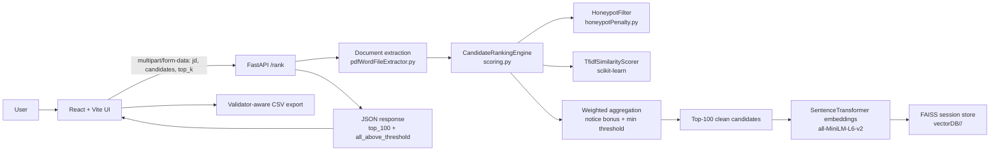

# Redrob AI Candidate Ranking System
AI-powered candidate ranking, filtering, and submission generation for Redrob Hackathon v4.

## Problem Statement
Hiring teams and hackathon evaluators need a way to rank a large candidate pool against a job description without manually reading every profile. This repository solves that by ingesting a JD and a JSONL candidate dump, extracting structured signals, ranking the pool with explainable heuristics, detecting suspicious or inflated profiles, and producing a submission-ready CSV.

The intended users are:

- Hackathon participants preparing a Redrob submission.
- Recruiters or screening teams who need a deterministic shortlisting pipeline.
- Reviewers who want transparent sub-scores rather than a black-box model.

## Solution Overview
The system is split into a React frontend and a FastAPI backend.

The backend accepts a PDF or DOCX job description plus a JSONL candidate dataset, converts each record into a resume-like text representation, scores candidates with a weighted feature model, removes honeypots before similarity scoring, embeds the JD and the surviving top candidates with a compact sentence-transformer model, and persists those vectors in a session-scoped FAISS store.

The frontend provides the upload workflow, progress animation, ranked results table, candidate detail modal, and CSV export logic that matches the validator rules.

No LLM reranker or training loop is present in the codebase. The pipeline is deterministic and inference-only.

## Architecture
The end-to-end flow is:



Data flow in practice:

1. The frontend uploads the JD and candidate file to `/rank`.
2. The backend extracts plain text from the JD and JSON objects from the candidate file.
3. Candidate records are transformed into resume text and scored on skills, experience, platform signals, and TF-IDF similarity.
4. Honeypot candidates are removed before the TF-IDF matrix is built.
5. The surviving pool is ranked, the top 100 are embedded, and both embeddings plus metadata are stored locally.
6. The backend returns a JSON payload that the frontend renders into a ranked table and CSV export.

## Tech Stack

| Layer | Detected technologies | Purpose |
| --- | --- | --- |
| Languages | Python, JavaScript, HTML, CSS, JSON, Markdown | Backend logic, frontend UI, config, and docs |
| Backend framework | FastAPI, Uvicorn | HTTP API, file upload handling, CORS |
| Python utilities | python-dotenv, python-multipart | Environment loading and multipart form parsing |
| Document parsing | pypdf, python-docx | JD extraction from PDF and DOCX |
| ML / NLP | scikit-learn, sentence-transformers, FAISS, pandas, numpy | TF-IDF, embeddings, vector search, tabular processing |
| Embedding model | sentence-transformers/all-MiniLM-L6-v2 | 384-dimensional normalized sentence embeddings |
| Frontend framework | React 19, React DOM, Vite 8 | Browser UI and dev server |
| Frontend tooling | Tailwind CSS, PostCSS, Autoprefixer, ESLint | Styling pipeline and linting |
| Frontend extras | xlsx | Present in `package.json`; no source usage was found in `src/` |
| Storage | Local FAISS index + pickle metadata | Session-scoped vector persistence |

No Docker, Streamlit, Gradio, notebooks, or automated test framework files were found in the repository.

## Repository Structure

```text
.
├── client/
│   ├── package.json
│   ├── vite.config.js
│   ├── tailwind.config.js
│   ├── postcss.config.js
│   ├── eslint.config.js
│   ├── .env.example
│   ├── src/
│   │   ├── App.jsx
│   │   ├── main.jsx
│   │   ├── index.css
│   │   ├── context/AppContext.jsx
│   │   └── components/
│   │       ├── DropZone.jsx
│   │       ├── CandidateModal.jsx
│   │       └── icons.jsx
│   └── public/
│       ├── favicon.svg
│       └── icons.svg
├── server/
│   ├── main.py
│   ├── requirements.txt
│   ├── .env.example
│   └── controller/
│       ├── rank.py
│       └── utils/
│           ├── pdfWordFileExtractor.py
│           ├── scoring.py
│           ├── honeypotPenalty.py
│           ├── embedding.py
│           └── vectorDB.py
├── Validation/
│   ├── validate_submission.py
│   ├── redrob_submission.csv
│   └── README.md
└── README.md
```

### Root

- `README.md` documents the project and the submission flow.
- `client/` contains the browser application.
- `server/` contains the API and ranking engine.
- `Validation/` contains the CSV validator and example submission file.

### `client/`

- `src/App.jsx` builds the full dark-themed upload, ranking, results, and export UI.
- `src/context/AppContext.jsx` owns upload state, API calls, progress animation, and CSV export.
- `src/components/DropZone.jsx` handles drag-and-drop file inputs.
- `src/components/CandidateModal.jsx` renders the candidate detail overlay.
- `src/components/icons.jsx` centralizes SVG icon components.
- `src/index.css` only contains Tailwind directives; most visible styling is inline inside the React components.
- `public/` stores static SVG assets.

### `server/`

- `main.py` defines the FastAPI application and the `/rank` endpoint.
- `controller/rank.py` orchestrates extraction, scoring, honeypot filtering, embedding, persistence, and response shaping.
- `controller/utils/pdfWordFileExtractor.py` converts uploaded PDFs, DOCX files, and JSONL data into plain Python values.
- `controller/utils/scoring.py` contains the ranking engine, score aggregation, TF-IDF logic, and explanation-friendly data model.
- `controller/utils/honeypotPenalty.py` removes unrealistic or inflated profiles before similarity scoring.
- `controller/utils/embedding.py` loads the embedding model once and exposes batch/single inference helpers.
- `controller/utils/vectorDB.py` persists vectors and metadata in a local FAISS store.
- `requirements.txt` lists the backend runtime dependencies.

### `Validation/`

- `validate_submission.py` enforces the hackathon CSV rules.
- `redrob_submission.csv` is a sample output file showing the required shape.
- `README.md` describes how to run the validator.

### Runtime artifact

- `vectorDB/<session_id>/` is created at runtime by the backend and stores `faiss_index.bin` plus `metadata.pkl`.

## Features

- Multi-format intake for JD files (`.pdf`, `.docx`) and candidate datasets (`.jsonl`, `.ndjson`, `.json` treated as JSONL-style lines).
- Resume-text synthesis that combines headline, skills, assessments, career history, education, and certifications into a single ranking document.
- Weighted feature scoring with explicit sub-scores for TF-IDF similarity, skill match, experience fit, and platform signals.
- Honeypot detection with hard removal, not a soft penalty.
- Explainable candidate ranking with transparent fields returned to the frontend.
- Local FAISS persistence for JD and shortlisted candidates.
- Validator-aware CSV export with deterministic ordering and tie-breaking.

## Pipeline

### 1. Load data
The frontend posts `jd`, `candidates`, and `top_k` as multipart form data to `POST /rank`.

### 2. Parse JD
`pdfWordFileExtractor.extract_text()` reads the uploaded file into memory and extracts text from either PDF pages or DOCX paragraphs.

### 3. Parse candidates
`extract_jsonl_records()` reads the candidate file line by line, parses each JSON object, and skips malformed rows without failing the entire request.

### 4. Build candidate text
Each record becomes a `Candidate` object. `ResumeTextBuilder` creates ranking text from:

- profile headline and summary
- current role, company, industry, and years of experience
- normalized skills, with extra repetition for expert/advanced skills
- skill assessment values
- career history descriptions
- education and certifications

### 5. Honeypot detection
`HoneypotFilter` removes candidates that trigger any of the following classes of signals:

- impossible company tenure
- experience/timeline mismatch
- excessive expert claims or zero-years expert claims
- overlapping or simultaneous jobs
- future dates
- suspiciously perfect profiles with no activity signals
- excessive job hopping
- unrealistic promotion velocity
- duplicate career entries
- impossible skill chronology
- education/employment inconsistency
- keyword stuffing
- activity contradictions

### 6. Score
`CandidateRankingEngine` computes:

- skill match score
- experience score
- platform signal score
- TF-IDF score on the cleaned pool only

### 7. Rank
Scores are aggregated into a final score, the notice-period bonus is applied, the minimum score threshold is enforced, and the result is ranked in descending order.

### 8. Generate submission
The frontend sorts candidates by score descending, then by `candidate_id` ascending for ties, and exports `redrob_submission.csv` with the exact validator header.

## Installation

### Clone the repository

```bash
git clone <repository-url>
cd AI-based-resume-picker
```

### Backend setup

```bash
cd server
python -m venv venv
.\\venv\\Scripts\\activate
pip install -r requirements.txt
copy .env.example .env
uvicorn main:app --reload
```

The API starts at `http://127.0.0.1:8000`.

### Frontend setup

```bash
cd client
npm install
copy .env.example .env
Set-Content .env "VITE_BACKEND_URL=http://127.0.0.1:8000"
npm run dev
```

The UI starts at `http://localhost:5173`.

### Validation

```bash
cd Validation
python validate_submission.py redrob_submission.csv
```

## Usage

### Run the backend API

```bash
cd server
uvicorn main:app --reload
```

### Use the browser UI
1. Start the backend.
2. Start the frontend.
3. Upload the JD PDF/DOCX and the candidate JSONL file.
4. Set the shortlist size.
5. Click **Rank candidates**.
6. Inspect the ranked table or open a candidate modal for details.
7. Export the CSV submission.

### Call the API directly

```bash
curl -X POST http://127.0.0.1:8000/rank \
	-F "jd=@path/to/job_description.pdf" \
	-F "candidates=@path/to/candidates.jsonl" \
	-F "top_k=100"
```

### Ranking, indexing, and inference

- There is no separate training command in this repository.
- There is no standalone indexing command; FAISS persistence happens inside the `/rank` request.
- Inference is the main mode of operation and is fully deterministic.

### Validation

The validator checks:

- CSV header: `candidate_id,rank,score,reasoning`
- Exactly 100 data rows
- `candidate_id` format `CAND_XXXXXXX`
- ranks 1 to 100 appearing exactly once
- non-increasing score order by rank
- tie-breaks resolved by ascending `candidate_id`

## Performance

The implementation is optimized for CPU-only execution and hackathon-scale datasets.

- `faiss-cpu` is used instead of GPU FAISS.
- Sentence embeddings are normalized, so inner product search is enough for cosine-like matching.
- Embedding generation uses batching with `batch_size=64`.
- TF-IDF uses `ngram_range=(1, 2)`, `sublinear_tf=True`, and `max_features=150000`.
- Honeypot filtering happens before TF-IDF, which reduces the size of the similarity matrix.
- The backend offloads CPU-bound ranking work to a threadpool to avoid blocking the event loop.
- The top-100 cap keeps embedding and persistence costs bounded.

No benchmark logs, latency reports, or memory profiling artifacts were found in the repository. Based on the code, the system is best suited to moderate candidate pools rather than extremely large-scale production ingestion.

## Design Decisions

- Deterministic heuristics were favored over an LLM-based ranker to keep the output reproducible and validator-friendly.
- Honeypots are removed before TF-IDF so suspicious records do not influence the similarity space.
- A weighted score model makes it easy to explain the ranking output in the UI and in the CSV reasoning column.
- `SentenceTransformer(all-MiniLM-L6-v2)` provides compact, fast embeddings without requiring GPU inference.
- `FAISS IndexFlatIP` pairs naturally with normalized embeddings and keeps search logic simple.
- The frontend performs final CSV ordering so the validator rules are enforced at the export boundary.

## Results

The repository produces three main outputs:

1. A JSON response from `POST /rank` containing `top_100`, `all_above_threshold`, score breakdowns, and honeypot metadata.
2. A CSV submission file named `redrob_submission.csv` from the UI export path.
3. A local session vector store at `vectorDB/user_123/` containing `faiss_index.bin` and `metadata.pkl`.

The checked-in `Validation/redrob_submission.csv` file demonstrates the required output shape. The repository does not include trained model checkpoints, benchmark dashboards, or accuracy reports.

## Future Work

- Externalize scoring and honeypot thresholds into config files.
- Add schema validation for the candidate JSONL payload.
- Add API and ranking tests for the validator-critical behaviors.
- Persist per-user or per-session IDs instead of the current hardcoded session value.
- Add Docker-based deployment for a one-command local environment.
- Add optional hybrid retrieval such as BM25 or a reranker if future requirements need it.
- Surface honeypot reasons in the UI for rejected candidates.

## Authors

Redrob Hackathon v4 submission. The repository does not include a named author list or team roster.